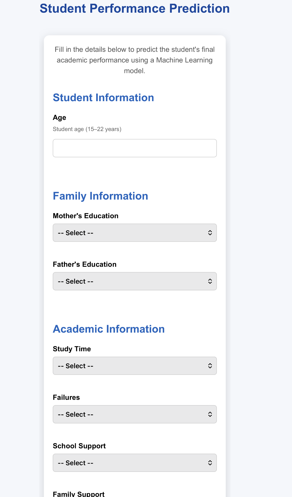
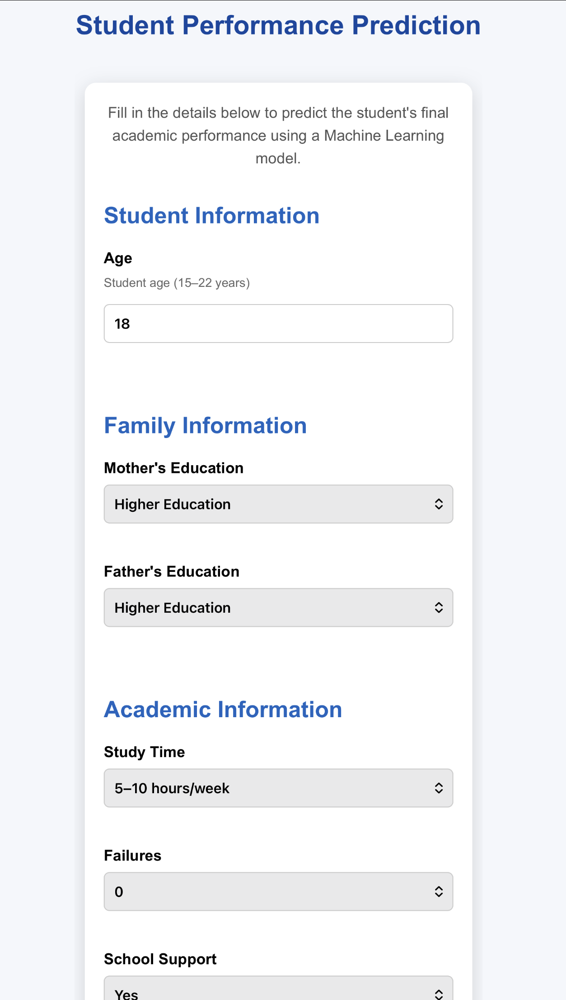
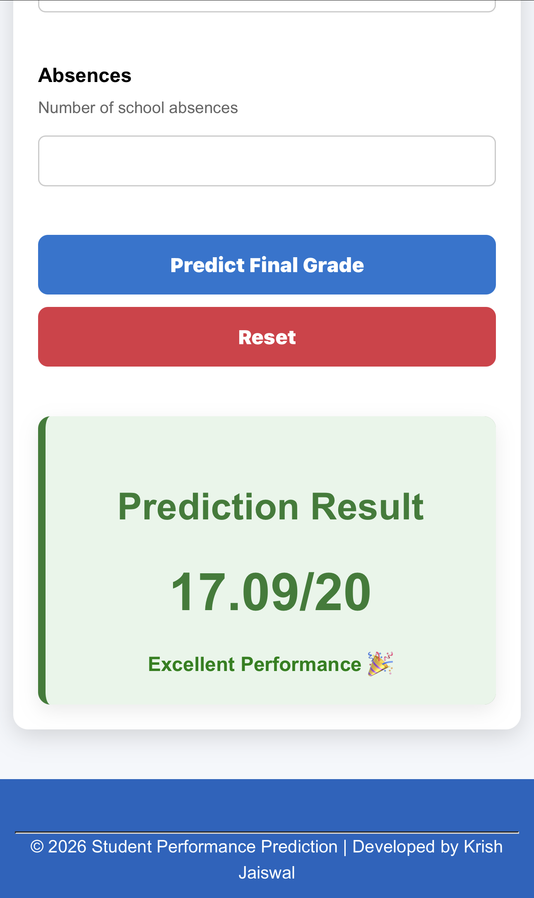

# 🎓 Student Performance Prediction using Machine Learning

A Machine Learning web application built using Flask, Scikit-Learn, and AWS EC2 that predicts students' final grades based on academic, family, and lifestyle factors.

---

## 🚀 Features

* Predicts final student grade (G3)
* Interactive Flask web application
* User-friendly form interface
* Real-time prediction
* Performance feedback based on predicted score
* Machine Learning model integration
* AWS EC2 Deployment

---

## 🛠 Tech Stack

* Python
* Flask
* Pandas
* NumPy
* Scikit-Learn
* HTML
* CSS
* Git
* GitHub
* AWS EC2
* Gunicorn
* Nginx
* Ubuntu

---

## 🧠 Machine Learning Model

Model Used: Random Forest Regressor

Target Variable: G3 (Final Grade)

Evaluation Metric:
- R² Score
- MAE
- RMSE

---

## 📂 Project Structure

```text
Student-Performance-Prediction
│
├── app
│   ├── static
│   │   └── style.css
│   ├── templates
│   │   └── index.html
│   └── app.py
│
├── data
├── models
│   └── best_model.pkl
│
├── notebooks
│   ├── 01_EDA.ipynb
│   ├── 02_Preprocessing.ipynb
│   ├── 03_Linear_Regression.ipynb
│   ├── 04_Model_Evaluation.ipynb
│   ├── 05_Decision_Tree.ipynb
│   ├── 06_Random_Forest.ipynb
│   └── 07_Model_Comparison.ipynb
│
├── images
│   ├── home.png
│   ├── form.png
│   └── result.png
│
├── requirements.txt
├── README.md
├── LICENSE
└── .gitignore
```

---

## 📊 Dataset

The project uses the **Student Performance Dataset**, which contains:

* Student Information
* Family Background
* Academic Performance
* Lifestyle Habits
* Previous Grades

The target variable is the student's **Final Grade (G3)**.

---

## 🎯 Project Objective

The goal of this project is to build a Machine Learning model capable of predicting a student's final academic performance using demographic, academic, and social attributes. The trained model is deployed as a Flask web application on AWS EC2 for real-time predictions.

--

## ⚙️ Installation

Clone the repository:

```bash
git clone https://github.com/krishjais783/student-performance-prediction.git
```

Move into the project directory:

```bash
cd student-performance-prediction
```

Install dependencies:

```bash
pip install -r requirements.txt
```

Run the Flask application:

```bash
python app/app.py
```

Open your browser:

```text
http://127.0.0.1:5000
```

> **Note:** Replace the repository URL above with your actual GitHub repository URL before publishing.

---

## 📸 Screenshots

### 🏠 Home Page



### 📝 Filled Form



### 📈 Prediction Result



---

## 🌐 Live Demo

👉 http://43.204.38.212

---

## ☁️ Live Deployment

Hosted on AWS EC2 using:

* Ubuntu Server
* Flask
* Gunicorn
* Nginx
* Python
* AWS EC2
* Git

---

## 📈 Machine Learning Workflow

* Data Cleaning
* Exploratory Data Analysis (EDA)
* Feature Engineering
* Data Preprocessing
* Model Training
* Model Evaluation
* Model Comparison
* Flask Deployment

---

## 🎯 Future Improvements

* Docker Support
* HTTPS
* Custom Domain
* Database Integration
* Analytics Dashboard
* Responsive UI
* User Authentication
* Student Report Generation

---

## 📊 Model Performance

**Best Model:** Random Forest Regressor

| Metric   | Score |
| -------- | ----: |
| R² Score |  0.84 |
| MAE      |  0.75 |
| RMSE     |  1.24 |

---

## 📄 License

This project is licensed under the **MIT License**.

See the **LICENSE** file for more details.

---

## 👨‍💻 Developer

**Krish Jaiswal**

**BCA (Hons.) – Artificial Intelligence & Data Science**

Machine Learning | Data Science | Python | Flask | AWS

